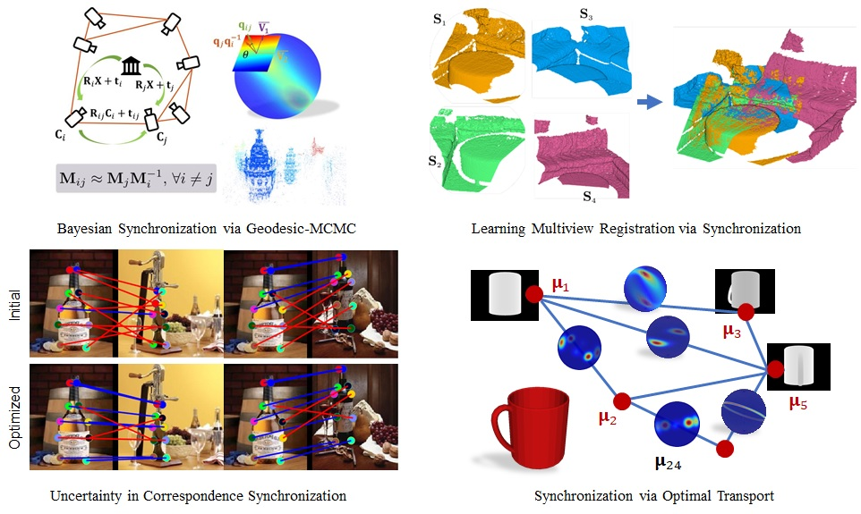

# Probabilistic Synchronization in Computer Vision
[Tolga Birdal](http://tbirdal.me/), [Umut Şimşekli](https://perso.telecom-paristech.fr/simsekli/) & [Michael Arbel](https://michaelarbel.github.io/) 

[Stanford University](http://www.stanford.edu), [Télécom ParisTech](http://www.telecom-paristech.fr/) & [University College London](https://www.ucl.ac.uk/)

This page presents a sequence of efforts in characterizing the multimodal uncertainty in a variety of synchronization problems. It also includes the resources about our recent **measure synchronization on the Riemannian manifolds** that is to appear in CVPR 2020. A brief illustration of the problems/approaches we consider is given below:

 

## Bayesian Pose Graph Optimization via Bingham Distributions and Tempered Geodesic MCMC
[NeurIPS 2018](https://neurips.cc/)

 

#### Abstract
We introduce Tempered Geodesic Markov Chain Monte Carlo (TG-MCMC) algorithm for initializing pose graph optimization problems, arising in various scenarios such as SFM (structure from motion) or SLAM (simultaneous localization and mapping). TG-MCMC is first of its kind as it unites asymptotically global non-convex optimization on the spherical manifold of quaternions with posterior sampling, in order to provide both reliable initial poses and uncertainty estimates that are informative about the quality of individual solutions. We devise rigorous theoretical convergence guarantees for our method and extensively evaluate it on synthetic and real benchmark datasets. Besides its elegance in formulation and theory, we show that our method is robust to missing data, noise and the estimated uncertainties capture intuitive properties of the data.

#### Downloads and Citing
[Paper](https://arxiv.org/abs/1805.12279) | [Poster](doc/neurips2018-poster.pdf) | [BibTex](doc/BirdalNeurips2018.bib)

		  @inproceedings{birdal2018bayesian,
            title={Bayesian pose graph optimization via bingham distributions and tempered geodesic mcmc},
            author={Birdal, Tolga and Şimşekli, Umut and Eken, Mustafa Onur and Ilic, Slobodan},
            booktitle={Advances in Neural Information Processing Systems},
            pages={308--319},
            year={2018}
          }
		  
## Probabilistic Permutation Synchronization using the Riemannian Structure of the Birkhoff Polytope
[CVPR 2019](http://cvpr2019.thecvf.com/) Best Paper Candidate

 

#### Abstract
We present an entirely new geometric and probabilistic approach to synchronization of correspondences across multiple sets of objects or images. In particular, we present two algorithms: (1) Birkhoff-Riemannian L-BFGS for optimizing the relaxed version of the combinatorially intractable cycle consistency loss in a principled manner, (2) Birkhoff-Riemannian Langevin Monte Carlo for generating samples on the Birkhoff Polytope and estimating the confidence of the found solutions. To this end, we first introduce the very recently developed Riemannian geometry of the Birkhoff Polytope. Next, we introduce a new probabilistic synchronization model in the form of a Markov Random Field (MRF). Finally, based on the first order retraction operators, we formulate our problem as simulating a stochastic differential equation and devise new integrators. We show on both synthetic and real datasets that we achieve high quality multi-graph matching results with faster convergence and reliable confidence/uncertainty estimates.

#### Downloads and Citing
[Paper](https://arxiv.org/abs/1904.05814) | [BibTex](doc/BirdalSimsekli2019.bib)

          @inproceedings{birdal2019probabilistic,
            title={Probabilistic Permutation Synchronization using the Riemannian Structure of the Birkhoff Polytope},
            author={Birdal, Tolga and Şimşekli, Umut},
            booktitle={Proceedings of the IEEE Conference on Computer Vision and Pattern Recognition},
            pages={11105--11116},
            year={2019}
          }
		  
#### Sources
The entire source code is to come. In the meanwhile:
The recent [geo-opt library](https://github.com/geoopt/geoopt) implements the RSGLD sampler that essentialy performs the Riemannian Langevin Monte Carlo with retractions, as we described. Alternatively, RHMC, the Hamiltonian version can also be used. On top of this, we have implemented the [Riemannian operators of the Birkhoff polytope](https://github.com/geoopt/geoopt/blob/master/geoopt/manifolds/birkhoff_polytope.py) that has been merged into the geoopt master. With those tools available and the [auto-grad of Pytorch](https://pytorch.org/tutorials/beginner/blitz/autograd_tutorial.html), minimizing our energy function is quite straightforward.

#### Oral presentation from CVPR 2019
<iframe width="900" height="506.25" src="https://www.youtube.com/embed/q03CXgyOHIE" frameborder="0" allow="autoplay; encrypted-media" allowfullscreen></iframe>

## Learning multiview 3D point cloud registration
[CVPR 2020](http://cvpr2020.thecvf.com/) 

 

#### Abstract
We present a novel, end-to-end learnable, multiview 3D point cloud registration algorithm. Registration of multiple scans typically follows a two-stage pipeline: the initial pairwise alignment and the globally consistent refinement. The former is often ambiguous due to the low overlap of neighboring point clouds, symmetries and repetitive scene parts. Therefore, the latter global refinement aims at establishing the cyclic consistency across multiple scans and helps in resolving the ambiguous cases. In this paper we propose, to the best of our knowledge, the first end-to-end algorithm for joint learning of both parts of this two-stage problem. Experimental evaluation on well accepted benchmark datasets shows that our approach outperforms the state-of-the-art by a significant margin, while being end-to-end trainable and computationally less costly. Moreover, we present detailed analysis and an ablation study that validate the novel components of our approach.

#### Downloads and Citing
[Paper](https://arxiv.org/abs/2001.05119) | [BibTex](doc/GojcicCVPR2020.bib)

          @inproceedings{gojcic2020learning,
            title={Learning multiview 3D point cloud registration},
            author={Gojcic Zan and Zhou, Caifa and Wegner, Jan D. and Guibas, Leonidas and Birdal, Tolga},
            booktitle={Proceedings of the IEEE Conference on Computer Vision and Pattern Recognition},
            year={2020}
          }
          
#### Sources
Upon publication our entire source code will be available under [3D_multiview_reg repository](https: //github.com/zgojcic/3D_multiview_reg). 

#### Short presentation from CVPR 2020
<iframe width="560" height="315" src="https://www.youtube.com/embed/Girxxvv8joQ" frameborder="0" allow="accelerometer; autoplay; encrypted-media; gyroscope; picture-in-picture" allowfullscreen></iframe>

## Synchronizing Probability Measures on Rotations via Optimal Transport
[CVPR 2020](http://cvpr2020.thecvf.com/) 

 

#### Abstract
We introduce a new paradigm, **measure synchronization**, for synchronizing graphs with measure-valued edges. We formulate this problem as maximization of the cycle-consistency in the space of probability measures over relative rotations. In particular, we aim at estimating marginal distributions of absolute orientations by synchronizing the `conditional' ones, which are defined on the Riemannian manifold of quaternions. Such graph optimization on distributions-on-manifolds enables a natural treatment of multimodal hypotheses, ambiguities and uncertainties arising in many computer vision applications such as SLAM, SfM, and object pose estimation. We first formally define the problem as a generalization of the classical rotation graph synchronization, where in our case the vertices denote probability measures over rotations. We then measure the quality of the synchronization by using Sinkhorn divergences, which reduces to other popular metrics such as Wasserstein distance or the maximum mean discrepancy as limit cases. We propose a nonparametric Riemannian particle optimization approach to solve the problem. Even though the problem is non-convex, by drawing a connection to the recently proposed sparse optimization methods, we show that the proposed algorithm converges to the global optimum in a special case of the problem under certain conditions. Our qualitative and quantitative experiments show the validity of our approach and we bring in new perspectives to the study of synchronization.

#### Downloads and Citing
[Paper](https://arxiv.org/pdf/2004.00663.pdf) | [BibTex](doc/BirdalCVPR2020.bib)

          @inproceedings{birdal2020measure,
            title={Synchronizing Probability Measures on Rotations via Optimal Transport},
            author={Birdal, Tolga and Arbel, Michael and Şimşekli, Umut and Guibas, Leonidas},
            booktitle={Proceedings of the IEEE Conference on Computer Vision and Pattern Recognition},
            year={2020}
          }

#### Short presentation from CVPR 2020
<iframe width="560" height="315" src="https://www.youtube.com/embed/yiy83nlexls" frameborder="0" allow="accelerometer; autoplay; encrypted-media; gyroscope; picture-in-picture" allowfullscreen></iframe>

